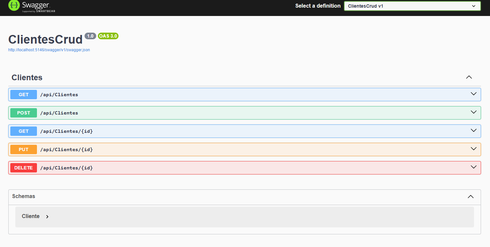

Mini API REST para gestionar clientes (Crear, Listar, Editar, Eliminar) usando:
- ASP.NET Core Web API
- Entity Framework Core (SQL Server)
- 
---
## Cómo correr
1. Configura la conexión en `appsettings.json`.
2. Ejecuta migraciones:
    ```bash
    dotnet ef migrations add InitialCreate
    dotnet ef database update

3. Inicia:
    ```bash
    dotnet run

4. Prueba endpoints en Swagger.

---

## Endpoints
- GET `/api/clientes`
- GET `/api/clientes/{id}`
- POST `/api/clientes`
- PUT `/api/clientes/{id}`
- DELETE `/api/clientes/{id}`

---

## Capturas

